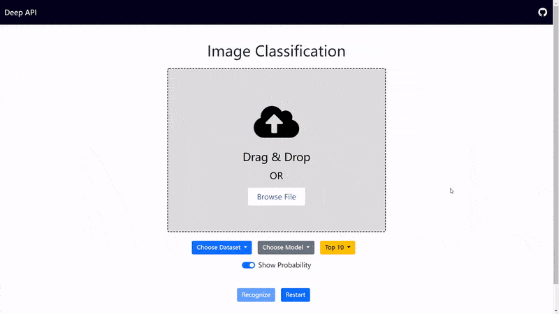

## Deep API

> Deep Learning as Cloud APIs.

This project provides an image classification cloud service for research on **Black-box Adversarial Attacks**.




### Quick Start

#### Using Docker:

```
docker run -p 8080:8080 wuhanstudio/deepapi
```

#### Python 3:

```
$ pip install deepapi

# By default, we enable all models on the server.
# Use deepapi -h to see more options.

$ python -m deepapi
Serving on port 8080...
```

The website and API service are available at https://localhost:8080.


### DeepAPI Client

To initiate **black-box adversarial attacks**, we can get predictions from a cloud API using `model.predict()`.

Behind the scene, this `model` makes predictions by sending a POST request to http://localhost:8080/vgg16_cifar10.

```
import numpy as np
from PIL import Image

from deepapi.api import DeepAPI_VGG16_Cifar10

# Load the image
x = Image.open("dog.jpg")
x = np.array(x)

# Initialize the model
model  = DeepAPI_VGG16_Cifar10('http://localhost:8080', concurrency=8)

# Predict
y = model.predict(np.array([x]))[0]

# Print the result
model.print(y)
```

</details>
<details>
  <summary><h3> Using Curl</h3></summary>

```
export IMAGE_FILE=test/cat.jpg
(echo -n '{"file": "'; base64 $IMAGE_FILE; echo '"}') | \
curl -H "Content-Type: application/json" \
     -d @- http://127.0.0.1:8080/vgg16_cifar10
```
</details>


<details>
  <summary><h3> Using Python Request</h3></summary>

You can also implement the API client from scratch using the request module.

```
def classification(url, file):
    # Load the input image and construct the payload for the request
    image = Image.open(file)
    buff = BytesIO()
    image.save(buff, format="JPEG")

    data = {'file': base64.b64encode(buff.getvalue()).decode("utf-8")}
    return requests.post(url, json=data).json()

res = classification('http://127.0.0.1:8080/vgg16_cifar10', 'cat.jpg')
```

This python script is available in the `test` folder. You should see prediction results by running `python3 minimal.py`:

```
cat            0.99804
deer           0.00156
truck          0.00012
airplane       0.00010
dog            0.00009
bird           0.00005
ship           0.00003
frog           0.00001
horse          0.00001
automobile     0.00001
```

#### Concurrent requests

Sending 5 concurrent requests to the API server:

```
$ python3 multi-client.py --num_workers 5 cat.jpg
```

You should see the result:

```
----- start -----
Sending requests
Sending requests
Sending requests
Sending requests
Sending requests
------ end ------
Concurrent Requests: 5
Total Runtime: 2.441638708114624
```
